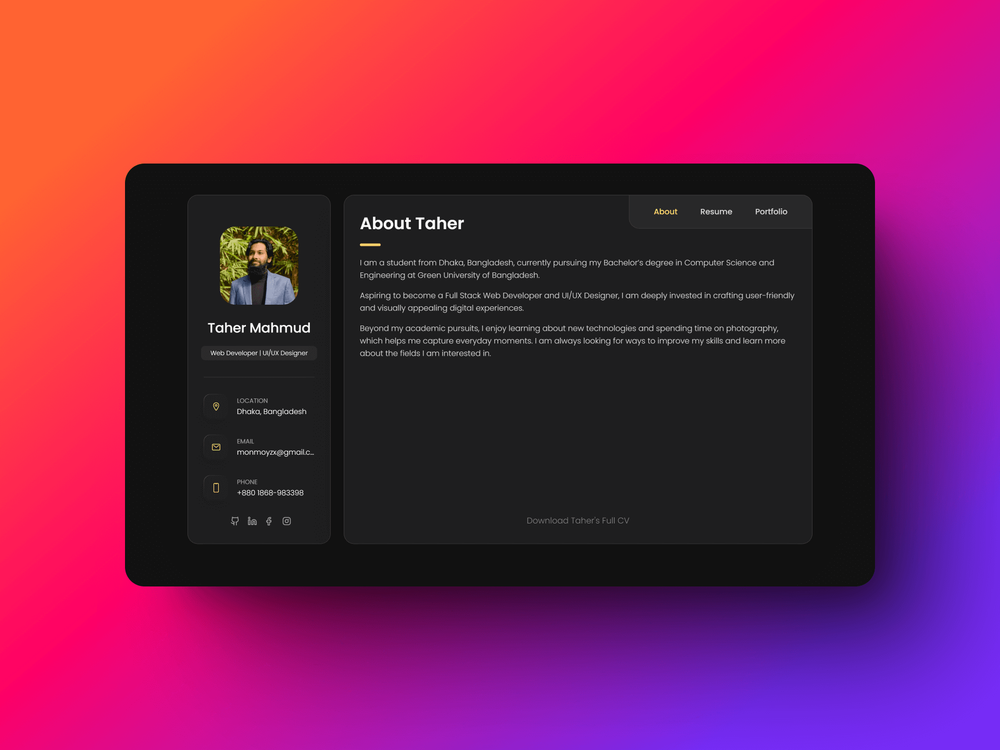
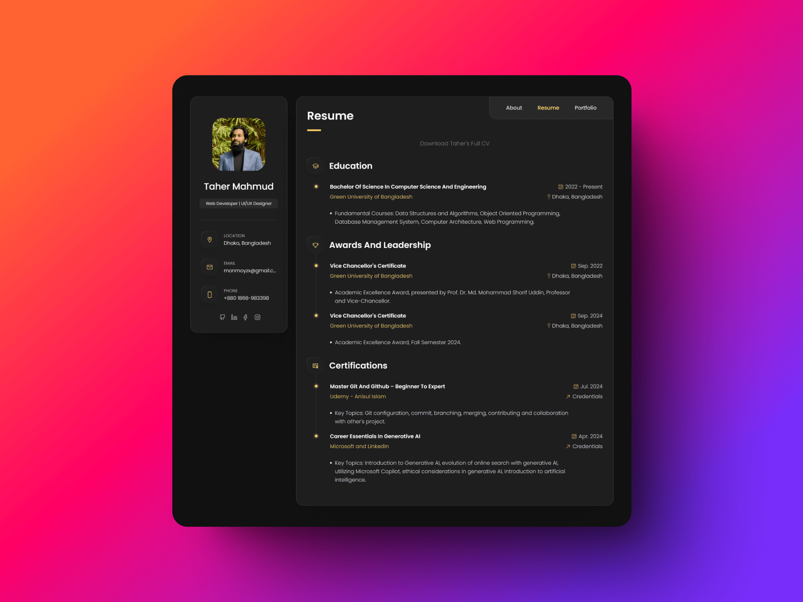
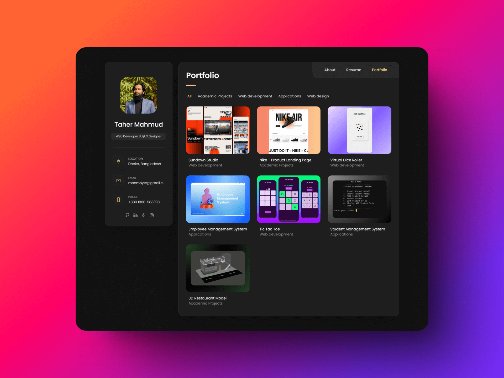
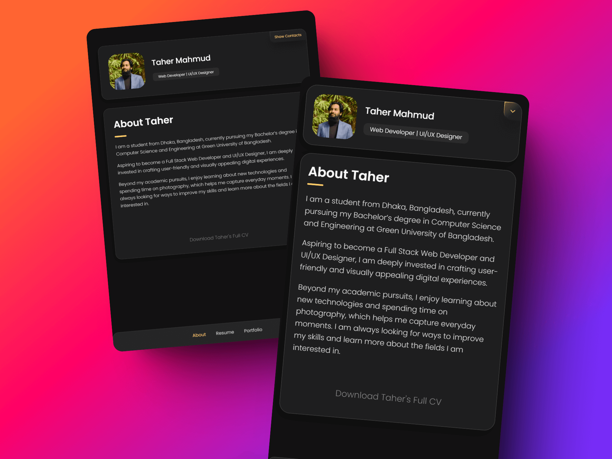
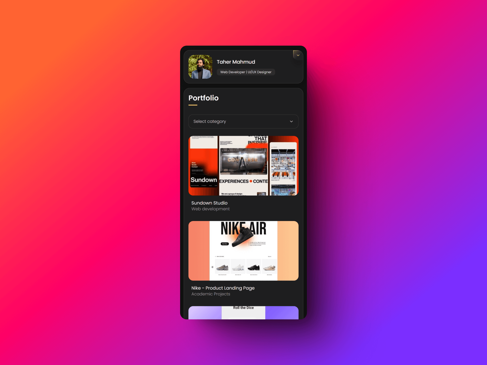

<a name="readme-top"></a>

# Taher Portfolio Website ✨

It is a fully responsive mobile first portfolio website, inspired by [codewithsadee/vcard-personal-portfolio](https://github.com/codewithsadee/vcard-personal-portfolio).

## Live Website: [https://taher-portfolio.pages.dev](https://taher-portfolio.pages.dev)

## 📷 Preview







- Minimal design.
- Subtle animations.
- Showcase resume and portfolio

## 🛠️ Setup Instructions

1. **Clone the Repository**:
   ```bash
   git clone https://github.com/taher-dev/Employee-Management-System.git
   ```

## 📲 Contact Info

> **Taher Mahmud Monmoy**
>
> <aside>
>   📩 E-mail: <a href="mailto:monmoyzx@gmail.com">monmoyzx@gmail.com</a>
> <br>
>   🧳 Linkedin: <a href="https://www.linkedin.com/in/taher-mahmud-monmoy/">Taher Mahmud Monmoy</a>
> <br>
>   👨🏻‍💻 GitHub: <a href="https://github.com/taher-dev">taher-dev</a>
>    
> </aside>

<p align="right" style="font-size: 14px; color: #555; margin-top: 20px;">
    <a href="#readme-top" style="text-decoration: none; color: #007bff; font-weight: bold;">
        ↑ Back to Top ↑
    </a>
</p>
